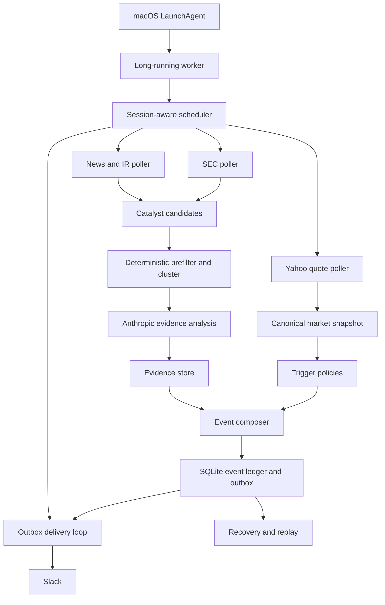

# HOOD Monitor PRD v2

문서 상태: 개발 기준 확정

작성일: 2026-09-02

대상 릴리스: local worker 기반 v2

기본 프로필: `$VRT`

## 0. 의사결정 요약

이 문서는 `hood_monitor`를 알림 스크립트가 아니라 한 종목을 깊게 추적하는
개인용 투자 모니터링 제품으로 다시 만드는 요구사항이다.

아래 결정은 구현 중 임의로 바꾸지 않는다.

1. 실시간 시장 데이터는 Yahoo REST polling으로 충분하다.
2. 정규장, 프리마켓, 애프터마켓의 기본 polling 간격은 2분이다.
3. production scheduler로 GitHub Actions cron을 사용하지 않는다.
4. 사용자의 Mac에서 하나의 Python worker를 `launchd`로 상시 실행한다.
5. 신규 유료 서버, 유료 시세 API, 유료 데이터베이스를 도입하지 않는다.
6. 현재 보유한 Slack webhook과 Anthropic API 외에 새 유료 서비스를 요구하지 않는다.
7. 알림은 현재 주가나 정확한 일일 수익률을 보여주는 시세판이 아니다.
8. 가격 이상 알림에는 상대 흐름, 거래량, 확인된 촉매를 하나의 사건으로 묶는다.
9. AI가 분석하지 못한 뉴스 제목과 요약 전 공시를 사용자에게 보내지 않는다.
10. 현재 운영 파일은 shadow 검증이 끝날 때까지 동결하고 새 코어를 병렬 개발한다.

추가 비용 없음은 외부 서비스를 새로 구독하지 않는다는 뜻이다. 기존 Anthropic
API는 실제 호출량에 따라 기존 계정 사용량이 발생할 수 있으므로, 결정론적 필터와
캐시를 먼저 적용해 AI 호출을 꼭 필요한 새 후보에만 제한한다.

## 1. 제품 정의

### 한 문장 정의

`hood_monitor`는 장기 투자자가 화면을 계속 보고 있지 않아도 `$VRT`의 의미 있는
가격 이상과 회사 고유 사건을 놓치지 않고, 시장 요인인지 종목 고유 요인인지 빠르게
판단하도록 돕는 Slack 기반 모니터다.

### 핵심 사용자

- 미국 주식 한 종목을 장기 보유하거나 DCA하는 개인 투자자
- 시세를 계속 확인해 충동적으로 대응하고 싶지 않은 사용자
- 단순 가격 알림보다 움직임의 맥락과 회사 논지 변화를 원하는 사용자
- Slack에서 30초 안에 핵심을 파악하고 필요할 때만 원문을 여는 사용자

### Job to be done

> 관심 종목에 평소와 다른 움직임이나 중요한 회사 사건이 생겼을 때, 나는 알림
> 하나만 보고 시장 전체 현상인지 종목 고유 현상인지 구분하고, 장기 투자 논지에
> 영향을 줄 근거가 있는지 판단하고 싶다.

### 사용자가 알림에서 답을 얻어야 하는 질문

1. 무엇이 새로 발생했는가?
2. 시장 전체와 반도체 흐름을 감안해도 이례적인가?
3. 관련 피어도 같이 움직였는가?
4. 거래량이 움직임을 뒷받침하는가?
5. 확인된 뉴스, 공시, 내부자 사건이 있는가?
6. 장기 논지를 바꿀 만큼 강한 근거인가?

## 2. 문제 정의

### 해결할 문제

- GitHub cron이 지연 또는 누락돼 하루에 몇 번만 실행되는 침묵 실패
- 가격 이상 알림과 원인 뉴스가 분리돼 사용자가 직접 다시 조사해야 하는 문제
- 같은 방향의 이미 보낸 구간을 반복해서 알려 새벽 내내 알림이 오는 문제
- `10-Q`, `SEC 원문`, `내용 확인 필요`처럼 행동 가치가 없는 공시 알림
- 내부 오류와 데이터 소스 상태가 투자 알림에 섞이는 문제
- 지표와 결론이 많지만 왜 중요한지 설명하지 못하는 문제
- 상태를 Git 커밋으로 저장해 중복 방지와 코드 배포가 충돌하는 문제

### 제품 원칙

- **사건 우선:** 기능이나 데이터 소스가 아니라 사용자에게 발생한 사건 단위로 묶는다.
- **근거 우선:** 해석보다 확인된 사실과 상대 흐름을 먼저 보여준다.
- **조용함 우선:** 새 정보가 없으면 아무것도 보내지 않는다.
- **원문 추적:** 뉴스, 공시, 회사 발표는 원문 링크를 가진다.
- **불확실성 표시:** 원인을 모르면 억지로 만들지 않고 촉매가 없다고 명시한다.
- **운영 상태 분리:** 투자 알림과 시스템 실패 알림을 같은 메시지에 섞지 않는다.
- **점진 전환:** 이전보다 낫다는 실제 비교 결과 없이 production을 교체하지 않는다.

## 3. 목표와 비목표

### v2 목표

- Mac이 깨어 있고 네트워크가 정상일 때 2분 간격으로 가격 이상을 감시한다.
- `+4.0%`, `-4.0%`에서 시작해 같은 방향의 새 1%p 구간만 알린다.
- 가격 알림 한 건에서 반도체 지수, 피어, 거래량, 최신 촉매를 함께 제공한다.
- 중요 SEC 공시와 뉴스는 요약 및 논지 관련성 분석 후 한 번만 보낸다.
- 장마감과 주간 알림을 별도 목적의 브리프로 제공한다.
- 재시작, 네트워크 장애, Mac 절전 뒤에도 중복이나 조용한 누락이 없도록 복구한다.
- 상태, 원문, 판단, 전달 기록을 SQLite에 남겨 실제 품질을 측정한다.

### v2 비목표

- 자동 주문, 매수/매도 추천, DCA 금액 산출
- 초 단위 호가, 틱 데이터, 체결창 재현
- 옵션 이상 거래나 유료 기관 데이터의 모사
- 다수 사용자를 위한 웹 서비스와 계정 시스템
- 모바일 앱 또는 대시보드
- 기사 본문을 우회 수집하거나 유료벽을 회피하는 기능
- 모든 종목을 동시에 스캔하는 범용 시장 스캐너

## 4. 비용과 운영 제약

| 항목 | 채택안 | 비용 | 제약 |
| --- | --- | --- | --- |
| production host | 사용자의 Mac | 추가 0원 | 종료·절전 중 실시간 중단 |
| process manager | macOS `launchd` | 추가 0원 | 로그인 사용자 세션 기준 |
| 시장 데이터 | Yahoo REST | 추가 0원 | 비공식 API 변경·지연 가능 |
| 공시 | SEC 공식 API/Archives | 추가 0원 | 요청 예절·속도 제한 필요 |
| 뉴스 | Yahoo RSS, 회사 IR | 추가 0원 | 기사 커버리지 제한 |
| 분석 | 기존 Anthropic API | 신규 구독 없음 | 기존 API 사용량은 발생 가능 |
| 전달 | 기존 Slack webhook | 추가 0원 | webhook 응답만으로 thread 관리 제한 |
| 상태 저장 | local SQLite | 추가 0원 | Mac 디스크 백업 필요 |
| CI | GitHub Actions push/manual | 현재 GitHub plan 범위 | 예약 실행에는 사용 금지 |

### 명시적 한계

무료 로컬 운영에서는 Mac이 꺼지거나 잠든 동안 실제 polling을 할 수 없다. 제품은
이를 가용한 것처럼 가장하지 않는다.

- 전원 연결 중 자동 잠자기 방지를 권장하고 설치 preflight에서 상태를 확인한다.
- 사용자 LaunchAgent는 로그인 뒤에 실행된다. 재부팅 후 로그인 전 공백도 복구 대상으로 기록한다.
- 마지막 heartbeat와 현재 시각의 차이로 중단 구간을 감지한다.
- 재기동 시 Yahoo intraday history와 SEC/news cursor를 이용해 복구한다.
- 복구 데이터만으로 정확한 발생 시각을 알 수 없으면 `지연 감지`로 표시한다.
- 과거 가격 임계치를 한꺼번에 여러 개 보내지 않고 최고 도달 구간 하나로 합친다.

## 5. 무료 환경에서 제공할 제품군

### P1. Live Move Monitor

2분마다 목표 종목을 확인하고 새 가격 구간 진입을 감지한다. 트리거가 생기면 같은
시점의 SOXX와 피어를 조회하고, 거래량과 최근 촉매를 합쳐 완결된 알림을 만든다.

### P2. Catalyst Watch

뉴스와 회사 IR 자료를 수집하고 관련성, 신규성, 투자 논지 영향을 분석한다. 단순
목표주가, 종목 비교, 로펌 홍보, 반복 전재는 제거한다.

### P3. Filing Intelligence

SEC 제출을 빠르게 감지하고 10-Q/10-K/중요 8-K/Form 4를 구조화한다. form 이름이
아니라 핵심 사실, 이전 기간 대비 변화, 논지 영향을 보여준다.

### P4. Daily Close Brief

매 거래일 장 마감 후 방향, 반도체/피어 상대 흐름, 완결 거래량, 그날의 중요 촉매를
한 번 정리한다. 장중 알림을 그대로 복사하지 않는다.

### P5. Weekly Thesis Review

한 주 동안 새로 확인된 논지 강화·위험 근거, 상대 흐름, KPI 변화와 다음 주 확인
일정을 정리한다.

### P6. Research Ledger

감지한 원문, AI 판단, 발송 여부와 억제 이유를 SQLite에 저장한다. CLI로 특정 날짜와
사건을 조회하고, 판단 규칙을 사후 검토할 수 있게 한다.

### P7. Replay and Quality Lab

과거 intraday 데이터나 저장된 fixture로 하루를 재생한다. 규칙 변경 전후의 알림 수,
트리거 시점, 메시지를 비교해 production에 넣기 전에 품질을 확인한다.

### P8. Local Operations

worker 상태, 마지막 성공 polling, outbox, 연속 실패와 복구 기록을 CLI와 로컬 로그로
확인한다. 투자 Slack에는 stack trace나 반복 실패를 보내지 않는다.

## 6. 정보 구조와 사건 우선순위

### 사건 등급

| 등급 | 의미 | 예시 | 기본 전달 |
| --- | --- | --- | --- |
| Critical | 즉시 맥락 확인이 필요한 종목 고유 사건 | 회계 문제, guidance 철회, 대형 인수 | 즉시 |
| High | 가격 또는 논지에 의미 있는 새 사건 | 새 ±1%p 가격 구간, 중요 공시 | 즉시 |
| Medium | 당일 판단에 유용하지만 급하지 않음 | 유의미한 회사 뉴스, 거래량 이상 | 즉시 또는 결합 |
| Low | 보조 맥락 | RSU 귀속, 반복 기사, 기술 지표 | 저장만 하거나 브리프에 결합 |

### 사용자 알림 종류

| 코드 | 이름 | 독립 발송 | 합칠 수 있는 내용 |
| --- | --- | --- | --- |
| `MOVE` | 가격 이상 | 예 | 상대 흐름, 거래량, 촉매 최대 2건 |
| `VOLUME` | 거래량 이상 | 세션당 1회 | 최근 촉매 |
| `CATALYST` | 회사 중요 사건 | 예 | 관련 공시·기사 cluster |
| `FILING` | 중요 SEC 공시 | 예 | 같은 실적의 8-K/10-Q |
| `INSIDER` | 유의미한 내부자 거래 | 예 | 같은 인물·같은 날 거래 |
| `CLOSE` | 장 마감 브리프 | 거래일당 1회 | 당일 사건 요약 |
| `WEEKLY` | 주간 논지 리뷰 | 주당 1회 | 한 주의 증거와 다음 일정 |

시스템 상태는 사용자 투자 사건이 아니므로 위 표에 포함하지 않는다.

## 7. 사용자 여정

### 여정 A: 정규장 +4% 진입

1. worker가 VRT quote를 조회한다.
2. 저장된 이전 정규장 종가 대비 `+4.0%` 구간에 처음 진입했음을 확인한다.
3. SOXX와 ETN/GEV/NVT를 동시에 조회한다.
4. 동시간대 20세션 거래량 기준과 최신 분석 완료 촉매를 가져온다.
5. 이벤트와 outbox를 하나의 SQLite transaction으로 저장한다.
6. Slack에 완결된 `MOVE` 알림을 보낸다.
7. 같은 날 `+4.9%`까지는 조용히 있고 `+5.0%` 진입 시 새 알림을 보낸다.

### 여정 B: 중요 10-Q 제출

1. SEC submissions poll에서 새 accession을 발견한다.
2. 해당 form과 문서를 내려받고 XBRL 및 본문에서 핵심 수치를 추출한다.
3. 기존 KPI와 전년/전기 수치를 비교한다.
4. 근거 기반 요약과 논지 영향을 만든다.
5. 같은 실적을 다루는 8-K가 있으면 한 사건으로 묶는다.
6. 제목, 핵심 변화, 논지 영향, SEC 직접 링크가 준비된 경우에만 보낸다.
7. 분석 실패 시 발송하지 않고 재시도 queue에 남긴다.

### 여정 C: Mac이 두 시간 잠든 뒤 재개

1. `launchd`가 worker를 다시 시작한다.
2. heartbeat gap을 감지하고 recovery mode로 들어간다.
3. 같은 거래일의 intraday bars를 시간순으로 재생한다.
4. 중단 중 +4, +5, +6을 통과했다면 `+6.0% 지연 감지` 한 건만 만든다.
5. +4/+5/+6 상태는 모두 소비 처리해 이후 역순 또는 중복 알림을 막는다.
6. SEC/news는 마지막 cursor 이후의 모든 후보를 정상 규칙으로 처리한다.
7. 로컬 operations 기록에 gap과 복구 결과를 남긴다.

## 8. 실행 모델과 polling cadence

모든 시간 판단은 `America/New_York` 거래소 시간으로 수행하고, 사용자 메시지만
`Asia/Seoul`로 표시한다. Mac의 로컬 timezone에 의존하지 않는다.

| 작업 | 활성 구간 | 기본 주기 | 비고 |
| --- | --- | --- | --- |
| heartbeat | worker 실행 중 | 30초 | SQLite에 마지막 생존 시각 기록 |
| outbox 전달 | worker 실행 중 | 15초 | 실패 시 지수 backoff |
| VRT quote | 거래일 04:00-20:00 ET | 2분 | 이전 정규장 종가 기준 |
| benchmark/peer quote | MOVE 발생 시 | 즉시 | SOXX/ETN/GEV/NVT 동시 조회 |
| intraday volume baseline | 시작 시, 09:25 ET | 1회 | 20세션 profile 캐시 |
| Yahoo/IR news | 거래일 04:00-20:00 ET | 5분 | 그 외 시간 15분 |
| SEC submissions | 평일 06:00-22:00 ET | 5분 | 그 외 시간 30분 |
| 분석 retry | pending 존재 시 | 2분 | 최대 시도 후 다음 긴 backoff |
| close brief | 거래일 16:15 ET | 1회 | 최종 거래량 안정 후 |
| weekly review | 월요일 08:10 KST | 1회 | 직전 거래 주간 기준 |
| log rotation | local date 변경 시 | 1회 | 30일 보관 기본 |

### Scheduler 규칙

- 하나의 장기 실행 event loop가 위 작업을 독립 task로 관리한다.
- 긴 SEC/AI 호출이 2분 quote task를 막지 않도록 I/O task를 분리한다.
- 같은 종류의 이전 task가 아직 실행 중이면 중첩 실행하지 않는다.
- 각 task는 timeout, retry, jitter를 가진다.
- quote 실패는 15초, 30초, 60초 뒤 재시도하고 이후 2분 주기로 복귀한다.
- provider의 `429` 또는 `Retry-After`는 명시된 대기 시간을 따른다.
- 미국 휴장일에는 quote task를 실행하지 않고 news/SEC만 저빈도로 유지한다.
- 조기 폐장일에는 exchange calendar의 실제 마감 시각을 사용한다.

## 9. 상세 기능 요구사항

우선순위는 `P0`가 production 전환 필수, `P1`이 첫 안정화 릴리스, `P2`가 품질
데이터 축적 후 개발이다.

### 9.1 Runtime

| ID | 우선순위 | 요구사항 | 수용 기준 |
| --- | --- | --- | --- |
| RT-001 | P0 | worker는 `launchd KeepAlive`로 관리한다. | 로그인 후 자동 시작하고 강제 종료 테스트에서 자동 재기동한다. |
| RT-002 | P0 | scheduler는 프로세스 내부에서 동작한다. | GitHub schedule이 없어도 2시간 동안 설정 주기대로 poll 기록이 남는다. |
| RT-003 | P0 | 각 task는 서로 실패 격리한다. | SEC timeout 중에도 quote와 outbox 주기가 유지된다. |
| RT-004 | P0 | 모든 시간은 exchange timezone으로 계산한다. | DST 시작·종료 fixture에서 개장, 마감, KST 표시가 정확하다. |
| RT-005 | P0 | worker는 graceful shutdown을 지원한다. | SIGTERM 시 진행 중 상태 transaction을 정리하고 10초 안에 종료한다. |
| RT-006 | P1 | `monitor doctor` 명령을 제공한다. | Python, config, DB, Keychain, network, Slack dry validation 결과를 보여준다. |
| RT-007 | P0 | 사용자 동의 시 worker를 전원 연결 중 `caffeinate -s`로 감싼다. | 디스플레이가 꺼져도 AC 전원 상태에서 2시간 poll 공백이 발생하지 않는다. |

### 9.2 Market quote와 가격 구간

| ID | 우선순위 | 요구사항 | 수용 기준 |
| --- | --- | --- | --- |
| MKT-001 | P0 | 거래일 04:00-20:00 ET에 VRT를 2분마다 조회한다. | 2시간 shadow run에서 중앙 간격 120초, p95 150초 이하이다. |
| MKT-002 | P0 | 기준가는 해당 trading date의 이전 정규장 종가로 고정한다. | 프리·정규·애프터 전환 중 baseline이 임의로 바뀌지 않는다. |
| MKT-003 | P0 | 첫 트리거는 절대변동 `4.0%`다. | `3.99%`는 무발송, `4.00%`는 상승 구간 이벤트를 만든다. |
| MKT-004 | P0 | 같은 방향은 새 정수 1%p 구간에서만 발송한다. | `4.4→4.7→5.0→4.9`에서 +4와 +5만 생성된다. |
| MKT-005 | P0 | 이미 지난 구간은 당일 재무장하지 않는다. | `8.1→5.2→7.1`에서 +5/+6/+7 재발송이 없다. |
| MKT-006 | P0 | 반대 방향의 ±4 도달은 별도 반전 사건이다. | `+5.1→-4.2`에서 -4 반전 이벤트 한 건이 생성된다. |
| MKT-007 | P0 | 첫 관측이 여러 구간 위라면 현재 최고 구간만 발송한다. | 첫 관측 `+6.3%`에서 +6 한 건만 생성되고 +4/+5는 소비된다. |
| MKT-008 | P0 | stale 또는 불완전 quote는 상태를 바꾸지 않는다. | 정규장 timestamp가 5분 이상 오래되면 이벤트와 watermark가 생성되지 않는다. |
| MKT-009 | P1 | 비정상 급변은 재확인한다. | 30% 이상 급변은 별도 Yahoo endpoint 또는 다음 poll 확인 전 발송하지 않는다. |
| MKT-010 | P0 | 현재 주가와 정확한 관측 수익률은 메시지에 넣지 않는다. | payload snapshot에서 price 및 `4.37%` 같은 수치가 없다. |

### 9.3 상대 성과

| ID | 우선순위 | 요구사항 | 수용 기준 |
| --- | --- | --- | --- |
| REL-001 | P0 | benchmark는 SOXX다. | 메시지에 `반도체 지수(SOXX)`로 표시된다. |
| REL-002 | P0 | 피어 바스켓은 ETN, GEV, NVT 동일가중이다. | 세 종목이 유효할 때 산술평균으로 분류한다. |
| REL-003 | P0 | 최소 두 피어가 있어야 피어 결과를 표시한다. | 한 종목만 유효하면 `피어 평균` 문구를 생략한다. |
| REL-004 | P0 | 결측 피어를 0%로 계산하지 않는다. | 2개 유효 값의 평균만 사용한다. |
| REL-005 | P0 | ±0.5%p 이내 차이는 동조로 분류한다. | 경계값 fixture가 아웃퍼폼/동조/언더퍼폼을 정확히 나눈다. |
| REL-006 | P0 | 상대 계산 수치는 내부에만 저장한다. | 사용자에게 정확한 종목/지수/피어 수익률이 노출되지 않는다. |

### 9.4 거래량

| ID | 우선순위 | 요구사항 | 수용 기준 |
| --- | --- | --- | --- |
| VOL-001 | P0 | 장중 누적 거래량은 과거 같은 시각까지의 20세션 평균과 비교한다. | 11:00 ET 관측값이 과거 11:00 ET 누적값만 사용한다. |
| VOL-002 | P0 | 최소 10개 유효 세션이 필요하다. | 9개 이하이면 판정과 사용자 문구를 모두 생략한다. |
| VOL-003 | P0 | 기본 이상 임계치는 1.5배다. | 1.49배는 정상, 1.50배는 이상으로 판정한다. |
| VOL-004 | P0 | 독립 VOLUME 알림은 거래일당 한 번만 보낸다. | 1.5→1.8→2.2배여도 독립 알림은 한 건이다. |
| VOL-005 | P0 | MOVE와 동시에 발생하면 한 메시지에 결합한다. | 같은 poll에서 MOVE와 VOLUME 두 Slack 메시지가 생기지 않는다. |
| VOL-006 | P0 | 장마감은 완결 거래량과 이전 20개 완결 세션을 비교한다. | 당일 세션이 baseline에 섞이지 않는다. |
| VOL-007 | P1 | 유효한 경우 당일/평균 거래량과 배율을 표시한다. | 천 단위 구분 숫자, 평균 기간, `터짐/평이`가 함께 보인다. |

### 9.5 News와 IR catalyst

| ID | 우선순위 | 요구사항 | 수용 기준 |
| --- | --- | --- | --- |
| CAT-001 | P0 | Yahoo RSS와 회사 IR을 수집한다. | 각 adapter contract fixture가 canonical candidate를 만든다. |
| CAT-002 | P0 | URL, 제목, 게시 시각, 출처가 없는 후보는 발송하지 않는다. | 필수 필드가 빠지면 quarantine에 기록된다. |
| CAT-003 | P0 | AI 전에 결정론적 제외 규칙을 적용한다. | 목표주가, 비교 기사, 로펌 홍보, 중복 전재가 AI를 호출하지 않는다. |
| CAT-004 | P0 | 15분 내 동일 사건은 cluster 하나로 묶는다. | 제목이 다른 세 전재 기사가 한 canonical event가 된다. |
| CAT-005 | P0 | 회사 직접 관련성과 새 사실이 확인돼야 한다. | 업종 일반론은 저장만 하고 Slack에 보내지 않는다. |
| CAT-006 | P0 | 사실과 해석을 분리한다. | 요약 payload에 `facts`, `interpretation`, `confidence`가 별도 존재한다. |
| CAT-007 | P0 | 인과관계를 출처 없이 만들지 않는다. | 기사에 없는 `주가가 오른 이유`를 AI가 출력하면 validation에 실패한다. |
| CAT-008 | P0 | AI 실패 후보는 consumed 처리하지 않는다. | 다음 retry에서 동일 후보가 다시 분석되고 중복 발송은 없다. |
| CAT-009 | P0 | MOVE에는 최근 24시간의 직접 촉매 최대 2건만 넣는다. | 세 건 이상이어도 evidence score 상위 두 건만 표시된다. |
| CAT-010 | P1 | 원출처를 전재 매체보다 우선한다. | 회사 IR과 전재가 함께 있으면 IR URL을 대표 source로 선택한다. |

### 9.6 SEC filing

| ID | 우선순위 | 요구사항 | 수용 기준 |
| --- | --- | --- | --- |
| SEC-001 | P0 | CIK 기반 submissions API를 5분 주기로 확인한다. | 새 accession이 정상 host 상태에서 10분 안에 감지된다. |
| SEC-002 | P0 | 첫 실행은 최근 제출을 baseline으로 등록한다. | 설치 직후 과거 공시가 한꺼번에 발송되지 않는다. |
| SEC-003 | P0 | accession number를 영구 dedupe key로 사용한다. | 재시작과 30일 후 재조회에서도 같은 filing이 다시 가지 않는다. |
| SEC-004 | P0 | form 이름만으로 알림을 만들지 않는다. | 제목·핵심 사실·논지 영향이 없으면 outbox가 생성되지 않는다. |
| SEC-005 | P0 | 10-Q/10-K는 핵심 KPI와 비교 기간을 구조화한다. | 최소 2개 핵심 수치 또는 명확한 정성 변화가 있어야 발송한다. |
| SEC-006 | P0 | 같은 실적의 8-K와 10-Q를 한 사건으로 묶는다. | 같은 acceptance window의 두 form이 한 알림만 만든다. |
| SEC-007 | P0 | 8-K는 material item만 발송한다. | 단순 exhibit, 중복 보도자료는 독립 알림에서 제외된다. |
| SEC-008 | P0 | SEC 직접 원문 링크를 제공한다. | 모든 FILING payload에 accession archive URL이 있다. |
| SEC-009 | P0 | `내용 확인 필요`와 raw form 나열을 금지한다. | golden message 검사에서 금지 문구가 0건이다. |
| SEC-010 | P0 | contact가 포함된 User-Agent와 보수적 요청률을 사용한다. | 모든 SEC request header와 최소 요청 간격 테스트를 통과한다. |
| SEC-011 | P1 | 403/429는 source 장애로 처리하고 backoff한다. | 투자 알림에 오류가 노출되지 않고 cursor도 전진하지 않는다. |

### 9.7 Insider transaction

| ID | 우선순위 | 요구사항 | 수용 기준 |
| --- | --- | --- | --- |
| INS-001 | P1 | Form 4 transaction code를 거래 의미로 변환한다. | P/S/A/M/F가 open-market, award, exercise, tax로 구분된다. |
| INS-002 | P1 | P만 장내 매수로 표현한다. | RSU 귀속 A가 `내부자 매수`로 표시되지 않는다. |
| INS-003 | P1 | 보상·세금·행사는 독립 방향성 신호로 보내지 않는다. | A/M/F 단독 filing은 ledger에만 저장된다. |
| INS-004 | P1 | 유의미한 P/S와 cluster 거래만 독립 발송한다. | 설정된 금액·보유비중 기준 미만 거래는 close/weekly 후보로만 남는다. |
| INS-005 | P1 | 인물, 직책, 거래 성격, 주식 수, 원문을 표시한다. | 내부자 알림 필수 필드 검사를 통과한다. |

초기 materiality 기본값은 장내 매수 10만 달러 이상, 장내 매도 100만 달러 이상
또는 보고 보유량의 20% 이상이다. 이 값은 데이터 축적 뒤 조정하며 투자 신호로
단정하지 않는다.

### 9.8 장마감과 주간 브리프

| ID | 우선순위 | 요구사항 | 수용 기준 |
| --- | --- | --- | --- |
| BRF-001 | P0 | 장마감 브리프는 거래일당 한 번만 보낸다. | 재시작해도 같은 trading date CLOSE가 중복되지 않는다. |
| BRF-002 | P0 | 기본 발송은 실제 마감 15분 후다. | 정상 거래일 16:15 ET, 조기 폐장일 실제 마감+15분이다. |
| BRF-003 | P0 | 방향, benchmark, peer, volume, 중요 촉매 순서를 지킨다. | golden snapshot에서 섹션 순서가 고정된다. |
| BRF-004 | P0 | 논지 변화는 강한 근거가 있을 때만 표시한다. | 근거 없는 날에는 `논지 훼손` 같은 문구가 없다. |
| BRF-005 | P0 | RSI, MACD, PCR, FINRA short volume은 기본 close에서 제외한다. | 기본 메시지에 해당 섹션이 없다. |
| BRF-006 | P0 | DCA 계획, 점수, 매수 처방을 표시하지 않는다. | 금지 문구 검사를 통과한다. |
| BRF-007 | P1 | weekly는 장중 알림 나열이 아니라 증거 변화를 요약한다. | 동일 사건 반복 없이 강화·위험·다음 확인 항목이 구분된다. |
| BRF-008 | P1 | 다음 주 공식 일정은 출처가 있을 때만 표시한다. | 실적·IR 일정마다 source URL이 있다. |

### 9.9 전달과 중복 방지

| ID | 우선순위 | 요구사항 | 수용 기준 |
| --- | --- | --- | --- |
| DLV-001 | P0 | event와 outbox를 같은 transaction에서 저장한다. | transaction 중단 fault injection에서 유실 또는 중복이 없다. |
| DLV-002 | P0 | 모든 사용자 사건은 deterministic event key를 가진다. | 같은 입력을 100회 처리해 outbox row가 하나다. |
| DLV-003 | P0 | Slack 실패는 지수 backoff로 재시도한다. | 500/timeout 뒤 30초부터 최대 15분 간격으로 재시도한다. |
| DLV-004 | P0 | 전달 성공 후 재시작해도 다시 보내지 않는다. | delivered row가 pending으로 돌아가지 않는다. |
| DLV-005 | P0 | 메시지는 최대 2,900자 내에 핵심을 완결한다. | 긴 news/filing fixture도 Slack text 제한을 넘지 않는다. |
| DLV-006 | P0 | production과 smoke 메시지를 명확히 구분한다. | smoke는 전용 prefix와 test channel 없이는 production webhook을 쓰지 않는다. |
| DLV-007 | P1 | 같은 15분 window의 연관 사건을 합친다. | news와 8-K가 같은 사건이면 중복 알림 대신 대표 사건 하나가 된다. |

### 9.10 운영과 설정

| ID | 우선순위 | 요구사항 | 수용 기준 |
| --- | --- | --- | --- |
| OPS-001 | P0 | provider별 성공, 실패, latency를 기록한다. | `monitor status`에서 마지막 성공과 연속 실패를 확인한다. |
| OPS-002 | P0 | raw 오류는 투자 메시지에 넣지 않는다. | 403, 429, timeout fixture에서 Slack 투자 payload가 생성되지 않는다. |
| OPS-003 | P0 | 10분 이상 heartbeat gap을 기록한다. | sleep simulation 뒤 gap row와 recovery run이 생성된다. |
| OPS-004 | P0 | 비밀값을 repo, DB payload, log에 저장하지 않는다. | secret scanner와 redaction test를 통과한다. |
| OPS-005 | P1 | operations Slack은 별도 webhook일 때만 사용한다. | 미설정 시 로컬 log/Notification Center만 사용한다. |
| CFG-001 | P0 | ticker/profile은 `monitor_config.md`로 변경 가능하다. | VRT를 fixture ticker로 바꿔도 코드를 수정하지 않고 시작한다. |
| CFG-002 | P0 | VRT 전용 thesis는 profile 데이터로 분리한다. | domain policy에 `VRT` literal이 없다. |
| CFG-003 | P0 | 설정 오류는 시작 전에 fail-fast한다. | CIK, benchmark, peer 부족을 doctor가 설명하고 worker가 polling하지 않는다. |
| CFG-004 | P1 | polling 값은 안전한 범위에서 설정 가능하다. | quote는 최소 60초, news/SEC는 최소 300초 미만으로 설정할 수 없다. |

## 10. 가격 상태 머신

### trading date

- trading date는 뉴욕 거래소 calendar가 부여한다.
- 프리마켓 04:00 ET부터 애프터마켓 20:00 ET까지 같은 trading date다.
- 상태는 KST 자정이나 Mac 자정에 초기화하지 않는다.
- 다음 유효 거래일 프리마켓 시작 시 새 상태를 만든다.

### 방향별 high-watermark

각 거래일에 아래 두 값을 독립 저장한다.

```text
upward_high_watermark
downward_high_watermark
```

예시:

```text
09:42  +4.4%  -> +4.0% 알림, up=4
09:44  +4.7%  -> 무발송
09:50  +5.1%  -> +5.0% 알림, up=5
10:10  +3.2%  -> 무발송, up=5 유지
12:20  +4.8%  -> 무발송
14:00  -4.2%  -> -4.0% 반전 알림, down=4
14:20  -5.0%  -> -5.0% 알림, down=5
```

### out-of-order와 duplicate

- quote timestamp가 이전 처리 시각보다 오래되면 상태 계산에서 제외한다.
- 같은 timestamp와 payload hash는 한 번만 처리한다.
- 같은 event key는 DB unique constraint로 차단한다.
- Slack 성공 여부와 watermark를 별도 파일에 나눠 쓰지 않는다.

## 11. 메시지 경험 계약

### 시각 계층

- 첫 줄: 방향 이모지, 종목, 구간, 사건, KST 시각
- 둘째 영역: 반도체 지수와 피어 상대 흐름
- 셋째 영역: 거래량이 유효할 때만 표시
- 넷째 영역: 확인된 촉매 또는 촉매 없음 한 줄
- 마지막: 최대 2개의 직접 원문 링크

이모지는 장식이 아니라 의미 표지로만 쓴다.

| 의미 | 이모지 |
| --- | --- |
| 상승 구간 | `📈` |
| 하락 구간 | `📉` |
| 상대 아웃퍼폼 | `↗️` |
| 상대 언더퍼폼 | `↘️` |
| 상대 동조 | `↔️` |
| 거래량 이상 | `🔥` |
| 회사/뉴스 사건 | `📰` |
| SEC 공시 | `🏛️` |
| 내부자 | `👤` |

### MOVE 예시

```text
📈 $VRT +4.0% 상승 구간 진입 | 09/02 23:14 KST

↗️ 반도체 지수(SOXX) 대비 아웃퍼폼
↘️ 피어(ETN·GEV·NVT) 대비 언더퍼폼

🔥 거래량 터짐
동시간대 20일 평균 1,856,146주 대비 3,095,486주 · 1.7배

무슨 일이 있었나
📰 대형 데이터센터 전력·냉각 수주 발표
회사는 신규 수주 규모와 납품 시점을 공개했다. backlog 전환과 생산능력 확대를
뒷받침하는 확인된 내용이다.
회사 발표 원문
```

촉매가 없으면 아래 한 줄로 끝낸다.

```text
확인된 직접 촉매 없음. 시장 수급 또는 아직 보도되지 않은 종목 고유 요인 가능.
```

### FILING 예시

```text
🏛️ $VRT 2분기 10-Q 핵심 변화 | 09/03 06:18 KST

확인된 사실
매출과 조정 영업이익이 전년 동기 대비 증가했고 연간 가이던스를 유지했다.
backlog는 증가했지만 tariff 비용과 현금흐름은 추가 관찰이 필요하다.

논지 영향
성장 논지 유지 · 마진 방어 확인 필요

SEC 원문
```

### CLOSE 예시

```text
🌙 $VRT 장 마감 | 09/03 KST

📉 오늘 방향: 음전
↘️ 반도체 지수(SOXX) 대비 언더퍼폼
↔️ 피어(ETN·GEV·NVT)와 동조

거래량 평이
20일 평균 대비 0.9배

오늘 확인된 중요 변화
📰 신규 액침냉각 파트너십 발표
```

### 금지 문구와 금지 구조

- 현재 가격과 정확한 일일 등락률
- `내용 확인 필요`
- raw `10-Q`, `8-K` 나열
- 근거 없는 `투자 논지 훼손 가능성`
- `DCA 중단`, `DCA 점수`, `진입 신호`
- `강한 매수`, `매수 추천`, `추격 자제`
- `데이터 상태 정상/실패`
- stack trace, HTTP status, retry count
- 같은 내용을 제목과 본문에서 반복하는 구성
- 뉴스 제목만 여러 개 나열하는 구성

## 12. AI 사용 정책

AI는 데이터 소스가 아니라 분류와 요약 도구다.

### AI 전에 수행할 작업

1. URL canonicalization
2. source와 published time 확인
3. ticker/company alias 직접 관련성 검사
4. 금지 category 필터
5. 제목 유사도와 event window 기반 clustering
6. 기존 canonical event hash 조회

### AI 입력

- 출처가 제공한 제목과 description
- 합법적으로 접근 가능한 본문 일부 또는 회사/SEC 원문
- VRT thesis profile과 KPI 목록
- 이미 알려진 동일 사건의 facts

### AI 출력 schema

```json
{
  "is_relevant": true,
  "is_new_fact": true,
  "event_type": "customer_order",
  "facts": ["source-backed fact"],
  "summary_ko": "two or three concise sentences",
  "thesis_impact": "strengthen|neutral|risk|damage",
  "impact_reason": "source-backed reason",
  "confidence": "high|medium|low"
}
```

### validation

- JSON schema가 맞지 않으면 재시도한다.
- facts가 입력 근거에서 확인되지 않으면 발송하지 않는다.
- `damage`는 guidance cut, 회계 문제, 대형 고객 상실처럼 정의된 강한 증거가 필요하다.
- `low` confidence는 독립 알림으로 보내지 않는다.
- AI 실패 시 raw 제목을 대신 보내지 않는다.
- 분석 성공 전에는 source cursor와 candidate 상태를 구분해 재처리할 수 있게 한다.

### 호출 예산

- deterministic filter와 dedupe 후에만 호출한다.
- 같은 canonical event는 모델을 다시 호출하지 않는다.
- 동일 poll의 후보는 가능한 한 batch로 분류한다.
- 일별 호출 수와 token을 기록해 기존 API 사용량 증가를 관찰한다.
- soft budget을 넘으면 후보를 queue에 보관하고 raw fallback을 보내지 않는다.

## 13. 목표 시스템 구조



### 모듈 경계

```text
src/investing_monitor/
  domain/
    models.py
    policies.py
    event_keys.py
    evidence.py
  application/
    market_monitor.py
    catalyst_monitor.py
    briefing.py
    delivery.py
  ports/
    market_data.py
    catalysts.py
    analysis.py
    repository.py
    notifier.py
  adapters/
    yahoo_market.py
    yahoo_news.py
    investor_relations.py
    sec_edgar.py
    anthropic_analysis.py
    slack_notifier.py
    sqlite_repository.py
  presentation/
    slack_messages.py
  runtime/
    scheduler.py
    recovery.py
    health.py
    settings.py
  cli.py
  worker.py
```

의존성은 `adapters -> application -> domain` 방향이다. domain은 HTTP, Slack,
SQLite, 파일 경로를 알지 못한다.

## 14. 상태와 데이터 모델

### 저장 위치

```text
~/Library/Application Support/InvestingMonitor/monitor.db
~/Library/Application Support/InvestingMonitor/cache/
~/Library/Logs/InvestingMonitor/worker.log
~/Library/LaunchAgents/com.okeycsy.investing-monitor.plist
```

runtime 파일은 Git repository에 저장하지 않는다.

### 핵심 테이블

| 테이블 | 목적 | 핵심 unique key |
| --- | --- | --- |
| `market_sessions` | 일별 baseline과 watermark | ticker + trading_date |
| `market_observations` | shadow/replay용 관측 | ticker + observed_at |
| `volume_profiles` | 동시간대 baseline | ticker + trading_date + minute |
| `source_cursors` | provider 마지막 확인 위치 | provider + profile |
| `source_items` | 수집 원문 메타데이터 | provider + source_id |
| `catalysts` | cluster와 AI 분석 상태 | canonical_event_id |
| `events` | 사용자 사건 ledger | event_key |
| `alerts` | 렌더링 버전과 payload | event_key + payload_version |
| `outbox` | 전달과 retry | alert_id |
| `heartbeats` | worker 생존과 gap | worker_id + recorded_at |
| `source_health` | provider 상태 | provider |

### 상태 보존

- event, filing accession, canonical catalyst dedupe는 영구 보존한다.
- 원문 본문 cache는 30일 뒤 삭제할 수 있다.
- market observations는 기본 90일 보존한다.
- aggregate metric과 alert payload는 유지한다.
- DB backup은 매일 worker 시작 전 압축본 하나를 만들고 최근 7개만 보존한다.

## 15. 중단과 복구 정책

### gap 등급

| gap | 처리 |
| --- | --- |
| 5분 미만 | 정상 jitter로 간주, 즉시 poll |
| 5분 이상 2시간 미만 | 같은 거래일 bars를 replay하고 최고 미발송 band 복원 |
| 2시간 이상 같은 거래일 | `지연 감지` MOVE 최대 1건, 나머지 band 소비 처리 |
| 이전 거래일 gap | stale MOVE 미발송, 미발송 CLOSE는 다음 개장 전까지만 복원 |
| 기간 무관 SEC/news | 마지막 cursor 이후 후보를 순차 처리, canonical dedupe 적용 |

### 복구 MOVE 규칙

- 누락 구간의 모든 1%p 알림을 연속 발송하지 않는다.
- 방향별 최고 도달 band 한 건만 발송한다.
- bars가 high/low만 제공하면 정확한 도달 시각 대신 `지연 감지`를 표시한다.
- 복구 중 발견한 band는 모두 watermark에 반영한다.
- 현재 시점에 이미 반납한 band도 과거 최고 도달이 확인되면 한 번만 지연 기록한다.
- 전 거래일 사건은 다음 거래일 가격 알림으로 가져오지 않는다.

### source 복구

- HTTP 실패에서 cursor를 전진시키지 않는다.
- parse 실패 원문은 quarantine에 저장하고 다음 버전에서 재처리 가능하게 한다.
- AI 실패는 `analysis_pending`으로 남긴다.
- Slack 실패는 outbox만 재시도하고 source를 다시 수집하지 않는다.

## 16. 운영 경험

### CLI

```text
monitor start           # launchd 설치 후 worker 시작
monitor stop            # 안전 종료
monitor status          # heartbeat, source, outbox 요약
monitor doctor          # config, secret, network, DB 점검
monitor run-once market # 실제 전송 없이 한 cycle 점검
monitor preview move    # fixture 기반 Slack 미리보기
monitor replay DATE     # 과거 session 재생
monitor logs            # 최근 구조화 로그 보기
```

### 로그 원칙

- JSON lines 형식으로 timestamp, task, provider, result, latency, event key를 남긴다.
- Slack webhook, API key, request header의 secret은 redaction한다.
- 기사 본문과 AI prompt 전체를 기본 로그에 쓰지 않는다.
- 성공 polling을 매번 INFO로 길게 남기지 않고 metric row로 집계한다.
- error에는 사용자 메시지가 아니라 개발자가 재현할 수 있는 context를 남긴다.

### 장애 알림

- 단일 실패는 로컬 로그에만 남긴다.
- 같은 핵심 source 3회 연속 실패 또는 quote 10분 공백은 incident를 연다.
- 별도 `OPS_SLACK_WEBHOOK_URL`이 있을 때만 Slack ops 알림을 한 번 보낸다.
- 별도 webhook이 없으면 macOS Notification Center와 `monitor status`에 표시한다.
- 장애가 지속돼도 같은 incident를 반복 발송하지 않는다.
- 복구 시 한 번만 닫고 gap과 복원 건수를 기록한다.

## 17. 비기능 요구사항

### 신뢰성 SLO

SLO는 Mac이 켜져 있고 자동 잠자기가 방지됐으며 인터넷이 정상이라는 조건부 목표다.

| 지표 | 목표 |
| --- | --- |
| quote poll 간격 | median 120초, p95 150초 이하 |
| MOVE 감지부터 Slack 전달 | p95 4분 이하 |
| SEC metadata 감지 | p95 10분 이하 |
| SEC 분석 완료와 전달 | p95 20분 이하 |
| 중요 news source 게시부터 전달 | p95 15분 이하 |
| 동일 event 중복 전달 | 0건 목표, 월 0.1% 미만 |
| worker gap 탐지 | 재기동 후 60초 이하 |
| pending outbox 복구 | 네트워크 복구 후 p95 2분 이하 |

### 성능

- idle worker 평균 CPU 사용량 2% 미만을 목표로 한다.
- SQLite와 cache를 포함한 90일 기본 저장공간은 1GB 미만을 목표로 한다.
- quote 한 cycle은 timeout 전 정상 조건에서 20초 안에 끝나야 한다.
- Slack message compose는 네트워크를 호출하지 않는 순수 연산이어야 한다.

### 보안과 개인정보

- secret은 환경 변수 또는 macOS Keychain에서만 읽는다.
- repo 안 `.env`, DB, fixture, log에 실제 secret을 저장하지 않는다.
- SEC contact email은 User-Agent 목적 외 payload에 노출하지 않는다.
- 외부 URL은 수집 source URL만 허용하고 Slack markdown injection을 escape한다.
- 의존성은 version range를 고정하고 CI에서 import와 테스트를 검증한다.

### 유지보수성

- production module은 500줄을 넘기지 않는 것을 목표로 한다.
- provider 응답은 adapter 밖으로 raw dict 형태로 새지 않는다.
- 메시지 렌더러는 domain policy를 다시 계산하지 않는다.
- configuration에는 사용자 조절 값만 두고 내부 상태를 섞지 않는다.
- 신규 알림 유형은 event model, policy, renderer, acceptance test를 함께 추가한다.

## 18. 데이터 품질과 예외 처리

| 상황 | 제품 동작 |
| --- | --- |
| Yahoo quote stale | 무발송, watermark 유지, 즉시 retry |
| previous close 누락 | MOVE 평가 중지, 데이터 복원 시 재평가 |
| benchmark 실패 | 종목 MOVE는 보내되 benchmark 줄 생략 |
| peer 2개만 성공 | 두 종목 동일가중 결과 표시 |
| peer 1개만 성공 | peer 결과 전체 생략 |
| volume baseline 9세션 | 거래량 섹션 생략 |
| news AI 실패 | raw 뉴스 무발송, pending retry |
| SEC 403 | cursor 유지, backoff, investment Slack 무발송 |
| Slack timeout | outbox retry, event 재생성 금지 |
| worker crash | launchd 재기동, heartbeat gap recovery |
| Mac sleep | wake 후 지연 감지와 cursor catch-up |
| DB locked | 짧은 retry 후 task만 실패 격리 |
| DB corrupt | 마지막 일일 backup으로 복구하고 incident 기록 |
| config 변경 | 새 profile hash로 검증 후 명시적 baseline 생성 |
| stock split 의심 | price event quarantine 후 재확인 |

## 19. 품질 측정

### 제품 KPI

| KPI | 정의 | 초기 목표 |
| --- | --- | --- |
| polling coverage | 예정 poll 대비 성공 poll | host 가동 중 99% 이상 |
| meaningful alert rate | 사용자가 유용하다고 판단한 알림 비율 | 80% 이상 |
| duplicate rate | 같은 사건의 중복 전달 비율 | 0.1% 미만 |
| unexplained MOVE | 직접 촉매가 없는 MOVE 비율 | 측정만, 억지로 낮추지 않음 |
| source traceability | 원문 링크가 필요한 알림 중 링크 보유 | 100% |
| garbage filing rate | form 이름만 있는 filing 알림 | 0% |
| recovery success | gap 뒤 cursor와 watermark 복원 성공 | 100% 테스트 |
| alert load | 거래일당 비정기 알림 수 | 평시 0~3건 목표 |

### 정성 평가 rubric

shadow 메시지마다 아래를 0 또는 1로 평가한다. 5점 미만은 production 후보가 아니다.

1. 제목만으로 사건을 이해할 수 있는가?
2. 반도체와 피어 대비 위치가 한눈에 보이는가?
3. 거래량 정보가 올바른 시간 기준인가?
4. 촉매 설명이 사실과 원문에 연결되는가?
5. 불필요한 내부 상태와 투자 처방이 없는가?
6. 이전 Claude 버전보다 같은 화면에서 얻는 판단 정보가 적지 않은가?

## 20. 출시 전략

### 원칙

- 모놀리스에 계속 덧붙이지 않는다.
- 기존 production은 새 worker가 검증될 때까지 유지한다.
- 같은 실제 입력으로 기존과 신규 결과를 나란히 비교한다.
- 테스트 통과만으로 cutover하지 않는다.

### Stage 0: Contract lock

산출물:

- 이 PRD 승인
- 기존 우수 메시지 screenshot과 현재 실패 메시지 golden fixture
- 금지 문구와 알림 상태 전이 테스트

통과 조건:

- 사용자 피드백이 요구사항 ID에 모두 연결된다.
- 구현자가 임의로 메시지 섹션을 제거할 수 없다.

### Stage 1: Local runtime foundation

산출물:

- SQLite migration과 repository
- internal scheduler
- launchd 설치/제거/상태 명령
- 전원 연결 중 sleep assertion을 적용하는 선택형 `caffeinate` wrapper
- heartbeat, outbox, structured logging

통과 조건:

- 2시간 local soak에서 quote scheduler가 p95 150초 이내다.
- 강제 종료, 네트워크 단절, 재시작에서 중복과 유실이 없다.

### Stage 2: Market product

산출물:

- Yahoo quote/history adapter
- 2분 MOVE monitor
- SOXX/peer context
- same-time volume profile
- MOVE/VOLUME Slack renderer

통과 조건:

- 모든 가격 상태 fixture 통과
- 정확한 주가/수익률 금지 검사 통과
- 이전 우수 메시지 대비 정보 계층 rubric 6점

### Stage 3: Evidence product

산출물:

- Yahoo news와 IR adapter
- SEC submissions/archive adapter
- deterministic filter와 clustering
- Anthropic structured analysis
- FILING/CATALYST/INSIDER renderer

통과 조건:

- `내용 확인 필요` 알림 0건
- AI 실패가 raw 뉴스 또는 consumed 상태로 바뀌지 않음
- SEC 403/429 recovery contract 통과

### Stage 4: Briefing and recovery

산출물:

- CLOSE와 WEEKLY composer
- sleep/wake catch-up
- replay와 quality report
- DB backup/restore

통과 조건:

- 2시간 gap에서 최고 band 한 건만 지연 발송
- 이전 거래일 stale MOVE가 다음 날 발송되지 않음
- close/weekly에 장중 알림 복사나 DCA 처방이 없음

### Stage 5: Shadow validation

기간:

- 최소 2개 전체 거래일
- 급변일이 없으면 historical replay 3일 추가

비교 항목:

- 예정 대비 실제 poll 수
- 최초 감지 지연
- 알림 개수와 중복
- 상대 흐름과 거래량 정확성
- 촉매 관련성 및 원문 일치
- 메시지 rubric

중단 조건:

- 신규 알림이 이전 우수 버전보다 판단 정보가 적다.
- raw SEC, raw news, 내부 오류가 한 번이라도 사용자 메시지에 노출된다.
- 중복 MOVE가 한 번이라도 재현된다.
- sleep/restart 뒤 상태가 설명 없이 초기화된다.

### Stage 6: Production cutover

1. shadow에서 검증한 동일 package를 production 설정으로 전환한다.
2. 기존 GitHub scheduled workflow를 비활성화한다.
3. local LaunchAgent를 production webhook으로 시작한다.
4. 첫 5개 거래일 매일 품질 report를 확인한다.
5. 5일 동안 회귀가 없을 때만 기존 `hood_monitor.py` 제거 계획을 세운다.

## 21. 개발 백로그

### Epic A: Runtime and persistence

| Task | 우선순위 | 산출물 |
| --- | --- | --- |
| A-01 DB schema/migration | P0 | versioned SQLite schema |
| A-02 repository 확장 | P0 | market, catalyst, event, outbox repository |
| A-03 scheduler | P0 | 독립 periodic task와 timeout |
| A-04 launchd package | P0 | plist, install/uninstall/status |
| A-05 heartbeat/recovery trigger | P0 | gap detection |
| A-06 log/backup | P1 | JSON log와 7일 DB backup |

### Epic B: Market intelligence

| Task | 우선순위 | 산출물 |
| --- | --- | --- |
| B-01 Yahoo quote adapter | P0 | canonical snapshot, freshness validation |
| B-02 trading session service | P0 | NYSE/DST/holiday/early close |
| B-03 price band state machine | P0 | direction high-watermarks |
| B-04 relative context | P0 | SOXX와 peer basket |
| B-05 volume profile | P0 | same-time 20-session baseline |
| B-06 intraday replay | P1 | gap backfill and test replay |

### Epic C: Catalyst intelligence

| Task | 우선순위 | 산출물 |
| --- | --- | --- |
| C-01 news/IR adapters | P0 | source candidates |
| C-02 deterministic quality filter | P0 | excluded categories and aliases |
| C-03 event clustering | P0 | canonical event IDs |
| C-04 Anthropic schema adapter | P0 | validated structured output |
| C-05 evidence ranking | P0 | MOVE max 2 catalysts |
| C-06 AI budget/queue | P1 | usage metric and soft budget |

### Epic D: Filing intelligence

| Task | 우선순위 | 산출물 |
| --- | --- | --- |
| D-01 SEC submissions adapter | P0 | cursor and accession baseline |
| D-02 Archives fetch/cache | P0 | polite requests and retry |
| D-03 XBRL KPI extraction | P0 | period comparisons |
| D-04 8-K material classifier | P0 | item and exhibit rules |
| D-05 earnings event merge | P0 | 8-K/10-Q canonical event |
| D-06 Form 4 parser | P1 | transaction semantics/materiality |

### Epic E: Product experience

| Task | 우선순위 | 산출물 |
| --- | --- | --- |
| E-01 MOVE/VOLUME renderer | P0 | compact Slack message |
| E-02 FILING/CATALYST renderer | P0 | fact/impact/source hierarchy |
| E-03 CLOSE renderer | P0 | one daily brief |
| E-04 WEEKLY renderer | P1 | evidence change review |
| E-05 golden message tests | P0 | screenshots and text fixtures |
| E-06 preview CLI | P1 | fixture message preview |

### Epic F: Verification and migration

| Task | 우선순위 | 산출물 |
| --- | --- | --- |
| F-01 provider contract tests | P0 | Yahoo/SEC/AI/Slack fixtures |
| F-02 failure injection | P0 | timeout/403/429/crash cases |
| F-03 local soak report | P0 | cadence and resource metrics |
| F-04 two-day shadow report | P0 | old/new comparison |
| F-05 cutover checklist | P0 | reproducible promotion |
| F-06 legacy retirement | P2 | monolith removal after observation |

## 22. 요구사항 추적표

| 사용자 문제 | 대응 요구사항 |
| --- | --- |
| GitHub가 하루 몇 번만 실행 | RT-001~003, MKT-001 |
| REST로 몇 분마다 감시 | MKT-001, polling cadence |
| 알림이 너무 자주 옴 | MKT-003~007, DLV-002, VOL-004 |
| +4 이후 +5/+6은 계속 필요 | MKT-004 |
| 역순 재알림 금지 | MKT-005 |
| SOXX와 피어 비교 | REL-001~006 |
| 거래량 폭발 여부 | VOL-001~007 |
| SEC `내용 확인 필요` 무가치 | SEC-004~009 |
| 뉴스 제목 나열 무가치 | CAT-003~009 |
| 정확한 가격과 일일 등락 제거 | MKT-010, REL-006 |
| DCA 점수와 계획 제거 | BRF-006 |
| 근거 없는 논지 훼손 제거 | BRF-004, AI validation |
| 실패 알림 반복 | OPS-002, OPS-005, incident dedupe |
| 이전 버전보다 정보가 빈약 | 메시지 계약, rubric 6번, Stage 5 중단 조건 |
| 추가 비용 없이 개발 | 비용과 운영 제약, local runtime |

## 23. 구현 중 변경 금지 사항

- polling 문제를 다시 GitHub cron 주기 변경으로 해결하지 않는다.
- 상태 저장을 다시 JSON 파일과 Git commit에 연결하지 않는다.
- provider 장애를 `변화 없음`으로 변환하지 않는다.
- 메시지를 짧게 만든다는 이유로 상대 흐름, 거래량, 촉매를 삭제하지 않는다.
- AI 품질 문제를 raw headline fallback으로 해결하지 않는다.
- 테스트 편의를 위해 production Slack으로 smoke 메시지를 보내지 않는다.
- 새 데이터가 있다는 이유만으로 기본 알림에 지표를 계속 추가하지 않는다.
- shadow 결과 없이 기존 운영 경로를 제거하지 않는다.

## 24. 구현 직전 필요한 사용자 설정

설계와 코드 개발은 지금 진행할 수 있다. 실제 local production 전환 직전에만 아래가
필요하다.

1. Mac에 Slack webhook과 Anthropic key를 Keychain으로 등록
2. 전원 연결 중 자동 잠자기 방지 허용 여부 확인
3. operations 알림을 별도 Slack webhook으로 받을지, 로컬 알림만 사용할지 결정
4. shadow 메시지를 받을 test channel webhook 확인

비밀값은 채팅이나 repository에 다시 적지 않는다.

## 25. Definition of Done

v2는 아래 조건을 모두 만족할 때만 완료다.

- GitHub schedule 없이 local worker가 2분 quote polling을 수행한다.
- sleep, crash, network failure 뒤 상태와 outbox를 복구한다.
- +4/+5 상태 전이와 역순 억제가 실제 재시작을 거쳐도 정확하다.
- 가격 MOVE 하나에서 반도체, 피어, 거래량, 촉매를 읽을 수 있다.
- SEC form 이름만 있는 알림과 raw 뉴스 나열이 0건이다.
- 정확한 현재 주가, 정확한 일일 수익률, DCA 처방이 노출되지 않는다.
- 모든 회사 사건은 원문과 추적 가능한 event key를 가진다.
- 실제 2개 거래일 shadow 비교에서 메시지 rubric이 모두 6점이다.
- production 5개 거래일 동안 중복 사건이 없고 예정 polling coverage가 99% 이상이다.
- 사용자가 이전 우수 버전보다 정보가 줄었다고 판단하면 완료로 처리하지 않는다.
