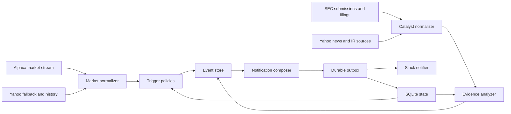

# HOOD Monitor 재개발 기준서

작성일: 2026-09-02

## 1. 결론

현재 제품은 기능 부족이 아니라 제품 구조와 운영 구조의 실패다.

- GitHub Actions 예약 실행은 모니터링 런타임으로 사용할 수 없다.
- 가격 감지와 원인 설명을 서로 다른 실행으로 분리해 핵심 사용자 경험이 끊겼다.
- 소스 저장소를 상태 데이터베이스로 사용하면서 중복 방지와 배포가 결합됐다.
- 수집, 판단, 표현, 전달이 4,841줄짜리 단일 파일과 전역 상태에 묶여 있다.
- 내부 진단 문구가 투자자 알림에 노출되고, 사용자가 원하는 결론보다 시스템 구현이 앞에 보인다.
- 테스트는 많아졌지만 실제 예약 실행 완전성이나 메시지의 의사결정 가치를 검증하지 못했다.

기술적으로는 이전 버전이 스크립트였지만 제품으로서는 현재 버전보다 나았다. 이전 버전은 한 알림 안에서 아래 흐름을 만들었다.

1. 어떤 임계치를 넘었는가
2. 시장과 피어 대비 움직임은 어떤가
3. 거래량이 움직임을 지지하는가
4. 설명 가능한 뉴스나 회사 이벤트가 있는가
5. 내부자 행동 등 보조 증거가 있는가

새 버전은 이 사용자 흐름을 복원하되, 이전 버전의 잘못된 명칭, 거짓 정밀도, 소스 미표기, 단일 파일 구조는 복원하지 않는다.

## 2. 제품 정의

### Job to be done

장기 투자자가 화면을 계속 보고 있지 않아도 관심 종목에서 의미 있는 변화가 생긴 순간을 놓치지 않고, 그 움직임이 시장 요인인지 회사 고유 요인인지 짧은 시간 안에 판단하게 한다.

### 핵심 사용자 질문

모든 알림은 다음 네 질문 중 해당되는 질문에 답해야 한다.

1. 무엇이 새로 발생했는가?
2. 시장 전체 움직임인가, 종목 고유 움직임인가?
3. 거래량과 확인된 촉매가 움직임을 뒷받침하는가?
4. 기존 장기 투자 논지를 바꿀 정도의 근거인가?

### 하지 않을 일

- 매수, 매도, DCA 금액을 지시하지 않는다.
- RSI, MACD, PCR 하나만으로 알림을 만들지 않는다.
- 확인되지 않은 뉴스와 주가 움직임을 인과관계로 단정하지 않는다.
- 원문을 읽으라는 말만 담은 SEC 알림을 보내지 않는다.
- 일시적 데이터 소스 실패를 투자 알림 채널에 반복 전송하지 않는다.
- 정확한 현재 주가와 정확한 일일 등락률을 표시하지 않는다.

임계치 구간인 `+4%`, `+5%`, `-4%`는 사건 이름이므로 표시할 수 있다. `+4.54%` 같은 정확한 일일 수익률은 표시하지 않는다.

## 3. 이전 버전과 현재 버전 비교

| 항목 | 2026-07-10 이전 버전 | 현재 버전 | 판정 |
| --- | --- | --- | --- |
| 첫 화면 의미 | 임계치, 상대 강도, 수급, 뉴스가 한 흐름 | 임계치와 내부 데이터 상태가 중심 | 이전 우세 |
| 스캔 속도 | 이모지가 의미별 표지 역할 | 문구가 길고 반복됨 | 이전 우세 |
| 가격 움직임 설명 | 같은 메시지에서 뉴스까지 확인 | 실시간 경로가 뉴스와 공시를 생략 | 이전 우세 |
| 출처 추적 | 링크 부족 | 원문 링크와 사실/해석 분리 | 현재 우세 |
| 명칭 정확성 | FINRA 일일 공매도를 공매도 잔고처럼 표현 | 체결 비중으로 정정 | 현재 우세 |
| 알림 피로 | 필터와 상태 규칙이 약함 | 규칙은 늘었으나 내부 상태가 노출 | 둘 다 미흡 |
| 실행 신뢰성 | GitHub 시간별 cron | GitHub 10분 cron | 둘 다 부적합 |
| 코드 구조 | 약 3,200줄 단일 파일 | 4,841줄 단일 파일 | 현재 악화 |
| 영속 상태 | Git 커밋 | Git 커밋과 전용 캐시 추가 | 현재 악화 |
| 제품 검증 | 실제 알림 중심 | 단위 테스트 중심, 실시간 SLO 없음 | 이전 우세 |

### 이전 버전에서 반드시 보존할 자산

- 중요한 한 사건을 하나의 완결된 알림으로 묶는 방식
- 제목만 읽어도 방향과 중요도를 알 수 있는 계층
- 상대 움직임과 거래량을 원인 뉴스보다 먼저 보여주는 순서
- 뉴스 제목과 2~3문장 요약
- 내부자 거래의 유형을 색으로 구분하는 방식
- 새 사실이 없으면 조용히 있는 기본 태도

### 이전 버전에서 복원하지 않을 결함

- 현재 주가와 정확한 일일 등락률 노출
- `beta x QQQ`를 기대수익률처럼 표현하는 거짓 정밀도
- 출처 링크가 없는 AI 요약
- 30분 POC를 확정적 저항 또는 지지로 단정하는 표현
- FINRA 일일 short volume을 short interest로 부르는 오류
- RSU 귀속을 방향성 내부자 매수로 오해하게 만드는 표현
- 기술 지표에서 매수나 추격 자제 같은 처방을 내리는 문구

## 4. 현재 실패 원인

### 제품 실패

기능 수를 제품 가치로 착각했다. 사용자는 더 많은 지표가 아니라 중요한 순간에 짧고 신뢰할 수 있는 설명을 원한다. 현재의 `오늘의 판단`, `투자 논지`, `데이터 상태`는 근거보다 결론을 먼저 말해 설득력을 떨어뜨린다.

### 알림 실패

실시간 경로에서 뉴스, 공시, 내부자 데이터를 생략했다. 그 결과 가장 중요한 가격 이상 알림이 가장 빈약한 메시지가 됐다. 원인은 배치 작업에서 나중에 발견되거나 아예 발견되지 않는다.

### 실행 실패

GitHub는 예약 이벤트가 고부하 때 지연되거나 누락될 수 있다고 명시한다. 실제 최신 기록에서도 새 10분 예약은 생성되지 않았다. 주기를 짧게 쓰는 것은 호출 실패 확률을 낮추지 못한다.

공식 근거: https://docs.github.com/en/actions/how-tos/troubleshoot-workflows

### 상태 관리 실패

전체 1,138개 커밋 중 990개가 상태 갱신 커밋이다. 실행 상태를 Git에 저장하므로 다음 문제가 생긴다.

- 실행 성공과 `git push` 성공이 서로 묶인다.
- 재시도, rebase, 동시 실행이 알림 중복 방지 상태에 영향을 준다.
- Slack 전송 성공 후 상태 커밋 실패 시 같은 알림이 다시 갈 수 있다.
- 코드 이력이 런타임 쓰기 990건으로 오염된다.
- 상태 스키마 변경과 코드 배포를 독립적으로 롤백할 수 없다.

### 데이터 실패

- Yahoo RSS와 HTML 본문 스크래핑은 누락과 차단에 취약하다.
- GitHub 공유 IP에서 SEC 403이 발생한다.
- 실시간 주가를 REST 폴링으로 가져오며 실행 스케줄까지 불확실하다.
- 소스 실패를 `변화 없음`과 구분하려다 내부 진단 상태가 사용자 메시지에 노출됐다.

### 코드 실패

- 수집, 도메인 판단, 상태 변경, Slack 렌더링, HTTP 호출이 한 파일에 있다.
- 전역 설정과 전역 `SOURCE_HEALTH` 때문에 테스트가 구현 세부사항에 결합된다.
- 테스트가 `cron 문자열이 존재한다`는 사실은 검증하지만 실제 예약 생성률은 검증하지 못한다.
- 어댑터 계약이 없어 Yahoo나 SEC 우회가 도메인 로직 안으로 번진다.

## 5. SWOT

### Strengths

- 한 종목과 하나의 투자 논지에 집중해 범용 시세 앱보다 깊게 만들 수 있다.
- Slack, Yahoo, SEC, Anthropic 연동 경험과 실제 운영 데이터가 있다.
- 사용자가 원하는 임계치 규칙과 불필요한 정보가 무엇인지 구체적으로 확인됐다.
- 이전 버전에 검증된 메시지 흐름과 높은 정보 밀도가 있다.
- VRT의 핵심 KPI, 위험 키워드, 피어 후보가 이미 정리돼 있다.

### Weaknesses

- 신뢰할 수 없는 예약 실행과 Git 기반 상태 저장
- 4,841줄 모놀리스와 전역 상태
- 이벤트 감지와 설명 생성의 분리
- 일부 수집원의 비공식 또는 불안정한 접근 방식
- 알림 품질을 측정하는 지표와 승인 기준 부재
- AI 출력 실패, 데이터 누락, Slack 전달 실패를 각각 다루는 상태 모델 부재

### Opportunities

- WebSocket 시장 데이터로 예약 실행 자체를 없앨 수 있다.
- SEC submissions API는 공시를 실시간으로 갱신하므로 안정된 IP에서 직접 감시할 수 있다.
- AI는 뉴스 생성기가 아니라 관련성 분류와 근거 기반 요약기로 제한해 신뢰도를 높일 수 있다.
- 동일 시간대 거래량 프로필을 사용하면 이전의 수급 알림을 더 정확하게 복원할 수 있다.
- 종목 프로필을 설정 파일로 유지하면서도 VRT 전용 투자 논지를 플러그인처럼 적용할 수 있다.
- 알림 원문, 판단 근거, 전달 이력을 저장하면 오탐과 누락을 실제로 평가할 수 있다.

### Threats

- 무료 시장 데이터의 지연과 거래소 커버리지 차이
- SEC와 뉴스 사이트의 IP 차단 또는 정책 변경
- AI의 원인 과잉 추론과 투자 논지 과장
- 알림 과다로 인한 사용자 무시
- worker 중단을 정상적인 `새 이벤트 없음`으로 오해하는 침묵 실패
- 배포 중 상태 손실 또는 중복 전송

## 6. 상용 제품에서 가져올 원칙

### TradingView

조건, 방향, 빈도를 독립된 설정으로 다룬다. `crossing up`, `crossing down`, `once`, `every time`처럼 트리거 의미가 명확하다.

- https://www.tradingview.com/support/solutions/43000763312-learn-how-to-configure-alerts/
- 적용: 가격 임계치 계산을 메시지 코드에서 분리하고 세션별 상태 전이로 만든다.

### Robinhood

5%와 10% 같은 명시적 가격 구간, 시간당/일일 빈도 정책, 사용자별 알림 설정을 둔다. AI digest는 무엇이 움직였는지뿐 아니라 무엇이 그 움직임을 만들었을 가능성이 있는지 설명한다.

- https://robinhood.com/us/en/support/articles/stock-price-alerts/
- https://robinhood.com/us/en/support/articles/cortex-digests/
- 적용: 트리거와 설명을 한 사용자 사건으로 묶고, 알림 예산과 mute 정책을 제품 기능으로 둔다.

### Benzinga Pro

가격 급등, 대량 거래, 옵션 이상을 실시간 signal로 구분하고, `Why Is It Moving`으로 가격 움직임과 촉매를 연결한다.

- https://www.benzinga.com/pro/feature/signals
- 적용: `movement detected`와 `cause candidates`를 별도 데이터로 만들되 최종 메시지는 하나로 조합한다.

### Koyfin

가격, 밸류에이션, 기술 지표, 뉴스, 공시, transcript를 서로 다른 알림 유형으로 관리한다. 알림을 누르면 해당 근거 문서로 이동한다.

- https://www.koyfin.com/features/alerts/
- 적용: 가격 이상 알림과 회사 이벤트 알림을 섞지 않고, 모든 회사 이벤트에는 직접 출처 링크를 둔다.

### Quartr

회사 1차 자료를 중심에 두고 AI 결과를 원문까지 추적할 수 있게 한다. 메시징과 KPI 변화도 시계열로 비교한다.

- https://www.quartr.ai/
- 적용: SEC, IR 보도자료, 실적자료를 뉴스보다 높은 증거 등급으로 취급하고 모든 논지 판단에 근거를 연결한다.

### Slack

Slack은 알림을 짧고 파싱 가능하며 실행 가능하게 만들고, 고빈도 알림은 묶어 보내며 스팸을 피하라고 권고한다.

- https://api.slack.com/start/distributing/guidelines
- 적용: 사용자 알림과 시스템 장애 알림을 분리하고 Block Kit 메시지 길이와 순서를 고정한다.

## 7. VRT 모니터링 프로필

### 시장 비교

- 반도체 수요 프록시: `SOXX`
- AI 전력/열관리 피어 바스켓: `ETN`, `GEV`, `NVT`

VRT의 2025 10-K는 Eaton, Schneider Electric, Legrand, Huawei를 대형 경쟁사로 명시한다. 미국 시장에서 같은 시간에 안정적으로 비교 가능한 종목 중 ETN은 직접 경쟁사다. GEV는 직접 경쟁사라기보다 AI 데이터센터 전력 공급 투자 사이클 프록시다. NVT는 전력 연결, 랙, liquid cooling 노출이 있어 VRT의 white-space 인프라 움직임을 보완한다.

- VRT 10-K: https://www.sec.gov/Archives/edgar/data/1674101/000167410126000008/vrt-20251231.htm
- Eaton: https://www.eaton.com/id/id-id/company/investor-relations/investor-toolkit/financial-reports/annual-report/letter-to-shareholders.html
- GE Vernova: https://www.gevernova.com/investors/annual-report/ceo-letter
- nVent: https://investors.nvent.com/press-releases/press-release-details/2025/nVent-Unveils-New-Liquid-Cooling-and-Power-Portfolio-at-SC25/default.aspx

세 종목은 사업이 완전히 동일해서가 아니라, VRT와 함께 움직이는 AI 전력 인프라 factor를 제거하기 위한 바스켓이다. 동일가중 평균을 사용하되 하나라도 데이터가 없으면 남은 종목 수와 구성 종목을 내부 로그에 기록한다. 한 종목만 남으면 `피어 평균`을 표시하지 않는다.

### 투자 논지 핵심 항목

- organic orders와 backlog 증가율
- backlog의 매출 전환과 취소 위험
- organic sales growth
- adjusted operating margin과 가격/원가 효과
- capacity expansion과 lead time
- revenue, EPS, free cash flow guidance
- hyperscaler와 chip platform 협력
- liquid cooling과 high-density power 제품 진척
- 공급망, tariff, 고객 집중, 장기 고정가 계약 위험

## 8. 알림 유형

### A. 장중 가격 이상 알림

발동 조건:

- 첫 임계치는 전일 정규장 종가 대비 `+4%` 또는 `-4%` 구간이다.
- 같은 방향에서 새로운 정수 구간에 처음 진입할 때만 추가 발송한다.
- `+4.4 -> +4.7`은 추가 발송하지 않는다.
- `+4.7 -> +5.0`은 `+5%` 알림을 발송한다.
- `+8.1 -> +5.2`는 하락한 구간을 다시 발송하지 않는다.
- 반대 방향의 `-4%`까지 도달하면 별도의 중대한 장중 반전이므로 한 번 알린다.
- 프로세스 재시작 뒤에도 같은 세션의 발송 이력을 유지한다.

알림 구성:

1. 임계치 사건
2. SOXX 대비 결과
3. ETN/GEV/NVT 동일가중 대비 결과
4. 동시간대 거래량 강도
5. 최근 24시간 내 직접 관련 촉매 최대 2건
6. 출처

### B. 거래량 이상 알림

장중 누적 거래량을 과거 완결 일평균과 직접 비교하지 않는다. 장중에는 같은 거래 시각까지의 과거 20개 세션 평균과 비교한다.

- 최소 기준 데이터: 10개 세션
- 이상 임계치: 동일 시간대 20세션 평균의 1.5배
- 장중 독립 알림: 세션당 최초 1회
- 가격 임계치와 동시에 발생하면 별도 알림 대신 가격 알림에 합친다.
- 장 마감에서는 완결된 당일 거래량과 이전 20개 완결 세션 평균을 비교한다.

### C. 회사 중요 이벤트 알림

대상:

- 10-Q, 10-K
- 실적 또는 가이던스 관련 8-K
- material acquisition, 고객, 공급, 자금조달, 경영진 변화
- 확인된 중대 규제/소송 사건
- 의미 있는 open-market 내부자 매수 또는 대규모 매도

규칙:

- form 이름만으로 보내지 않는다.
- deterministic extraction 또는 AI 분석이 끝나지 않으면 사용자에게 보내지 않고 재시도한다.
- 사실, 전기/전년 비교, 투자 논지 영향, 원문 링크가 모두 있어야 한다.
- 동일 실적을 설명하는 8-K와 10-Q는 하나의 사건으로 묶는다.

### D. 뉴스 촉매 알림

- 회사 직접 관련성이 확인된 새 사실만 보낸다.
- 목표주가, 적정가치, 종목 추천, 로펌 고객 모집, 단순 비교 기사는 제외한다.
- 기사 제목과 본문에 없는 원인을 추정하지 않는다.
- 15분 안에 같은 사건의 기사가 여러 건이면 신뢰도가 가장 높은 원문 하나로 합친다.
- 회사 IR/SEC > 통신사/주요 매체 > 2차 요약 매체 순으로 출처 우선순위를 둔다.

### E. 장 마감 요약

매 거래일 한 번 보낸다.

- 방향: 양전/음전/보합
- SOXX와 피어 바스켓 대비 상대 흐름
- 완결 거래량: 20일 평균 대비 터짐/안 터짐
- 오늘 확인된 중요 촉매
- 투자 논지 변화는 강한 증거가 있을 때만 표시

RSI, MACD, PCR, 공매도 체결 비중은 기본 장 마감 메시지에서 제외한다. 연구 화면이 없는 Slack 알림에 보조 지표를 모두 밀어 넣으면 핵심이 흐려진다.

### F. 주간 요약

- 이번 주 새로 확인된 논지 강화/위험 증거
- 주간 시장 및 피어 상대 흐름
- 공시와 회사 발표의 핵심 KPI 변화
- 다음 주 예정 실적, 투자자 행사, 확인할 항목

주간 요약은 장중 알림을 그대로 나열하지 않는다.

### G. 시스템 상태 알림

투자 알림과 다른 경로로 보낸다.

- 단일 일시 실패는 로그만 남긴다.
- 같은 핵심 소스가 3회 연속 실패하거나 10분 이상 중단되면 한 번 알린다.
- 복구 시 한 번 알린다.
- `SEC 403`, `Yahoo 실패`, `AI 키 없음`을 투자 메시지 본문에 넣지 않는다.

## 9. 메시지 계약

### 가격 이상 예시

```text
📈 $VRT +4% 상승 구간 진입 | 09/02 23:14 KST

↗️ 반도체 지수(SOXX) 대비 아웃퍼폼
↗️ 피어(ETN·GEV·NVT) 대비 아웃퍼폼

🔥 거래량 동반
동시간대 20일 평균 대비 1.7배

무슨 일이 있었나
🟢 대형 데이터센터 전력·냉각 수주 발표
회사는 신규 수주 규모와 납품 시점을 공개했다. 기존 backlog 전환과 생산능력 확대를 뒷받침하는 내용이다.
회사 발표 원문
```

확인된 촉매가 없을 때는 다음 한 줄만 표시한다.

```text
확인된 직접 촉매 없음. 시장 수급 또는 아직 보도되지 않은 종목 고유 요인 가능.
```

### SEC 예시

```text
🏛️ $VRT 2분기 10-Q 핵심 변화

매출과 영업이익이 전년 동기 대비 증가했다.
backlog와 수주 흐름은 기존 성장 논지를 지지하지만, 현금흐름과 tariff 비용은 추가 확인이 필요하다.

논지 영향: 성장 논지 유지
SEC 원문
```

금지 문구:

- `내용 확인 필요`
- `SEC 원문`만 단독 표시
- 근거 없는 `투자 논지 훼손 가능성`
- `DCA 중단 검토`
- `강한 매수`, `추격 자제`
- 사용자에게 의미 없는 `데이터 상태: 정상/실패`

## 10. 신뢰성 목표

### 사용자 SLO

- 장중 임계치 감지부터 Slack 전송까지 p95 90초 이내
- 핵심 worker 월 가용성 99.5% 이상
- 동일 사건 중복 알림률 0.1% 미만
- 확인된 신규 SEC 공시 감지 5분 이내
- AI가 실패한 이벤트를 성공 처리하거나 폐기하지 않음
- 소스 장애를 `새 사건 없음`으로 오판하지 않음

### 운영 지표

- 마지막 market event 수신 시각
- 마지막 SEC/news poll 성공 시각
- provider별 연속 실패 횟수
- 감지한 event 수, 억제한 duplicate 수
- outbox pending/failed 수
- Slack 전달 지연
- worker restart 횟수

## 11. 목표 아키텍처



### 런타임

- GitHub Actions는 test/build/deploy에만 사용한다.
- 실제 모니터는 항상 실행되는 단일 Python worker다.
- 시장 데이터는 WebSocket 이벤트를 받아 예약 실행을 제거한다.
- SEC와 뉴스는 worker 내부의 주기 작업으로 실행하며 실패 시 backoff한다.
- systemd 또는 컨테이너 restart policy가 프로세스를 자동 복구한다.

Alpaca는 주식, 옵션, 뉴스용 실시간 WebSocket을 제공하고 REST polling보다 streaming 사용을 권장한다.

- https://docs.alpaca.markets/us/docs/streaming-market-data

### 배포 권고

단일 사용자, 단일 종목 제품이므로 Kubernetes나 메시지 브로커는 필요 없다. 고정 IP와 영속 디스크를 가진 1GB Linux 인스턴스 한 대가 적절하다.

- 1순위: AWS Lightsail 1GB Linux, 월 7 USD
- 이유: 항상 실행, 고정 IPv4, SQLite 영속 디스크, systemd, SEC 직접 호출 가능성, 단순한 운영
- 공식 가격: https://docs.aws.amazon.com/lightsail/latest/userguide/amazon-lightsail-bundles.html

GitHub `push` 이벤트는 CI/CD로 계속 사용한다. 테스트 통과 후 SSH 배포하고 worker를 재시작한다. 예약 cron은 제거한다.

### 데이터 공급자

- 실시간 시장: Alpaca WebSocket 우선
- 전일 종가/과거 OHLCV/보조 fallback: Yahoo
- 공시 메타데이터와 XBRL: SEC 공식 API
- 공시 원문: SEC Archives, 속도 제한과 캐시 적용
- 뉴스: Yahoo RSS + 회사 IR feed, 향후 유료 뉴스 API 교체 가능
- 해석: Anthropic structured JSON
- 전달: Slack

SEC submissions API는 인증 없이 사용할 수 있고 통상 1초 이내에 갱신된다.

- https://www.sec.gov/search-filings/edgar-application-programming-interfaces

## 12. 모듈 경계

```text
src/investing_monitor/
  domain/
    models.py          # 시장, 촉매, 알림, 상태 값 객체
    policies.py        # 임계치, 상대성과, 거래량, 중복 방지 규칙
  application/
    monitor.py         # 이벤트를 받아 use case 실행
    enrichment.py      # 촉매 조회와 근거 조합
  ports/
    market_data.py     # 실시간/과거 시장 데이터 인터페이스
    catalysts.py       # 뉴스/SEC/내부자 인터페이스
    analysis.py        # AI 분석 인터페이스
    notifier.py        # Slack 전달 인터페이스
    repository.py      # 상태, event, outbox 인터페이스
  adapters/
    alpaca_market.py
    yahoo_market.py
    yahoo_news.py
    sec_edgar.py
    anthropic_analysis.py
    slack_notifier.py
    sqlite_repository.py
  presentation/
    slack_messages.py  # 순수 메시지 렌더러
  worker.py            # 프로세스 수명주기와 periodic task
```

의존 방향은 adapters -> application -> domain이다. domain은 requests, Slack Block Kit, 파일 경로를 알지 못한다.

## 13. 상태와 전달

### SQLite 테이블

- `market_sessions`: 세션 날짜, 방향별 최고 발송 구간, 거래량 발송 여부
- `source_cursors`: provider별 마지막 확인 위치와 ETag
- `catalysts`: 원문 hash, canonical event key, 분석 상태, 근거
- `alerts`: event key, 유형, 생성 시각, payload version
- `outbox`: alert id, payload, attempt, next retry, delivered_at
- `source_health`: 성공 시각, 연속 실패, 장애 알림 상태

### 전달 순서

1. 이벤트와 dedupe key를 저장한다.
2. 같은 트랜잭션에서 outbox row를 만든다.
3. Slack 전송 worker가 pending row를 가져간다.
4. 성공하면 `delivered_at`을 기록한다.
5. 실패하면 지수 backoff로 재시도한다.

이 구조는 프로세스가 재시작돼도 알림을 잃지 않는다. Git 커밋은 상태 저장에 사용하지 않는다.

## 14. 테스트 전략

### 단위 테스트

- `+4.4 -> +4.7 -> +5.0 -> +4.9` 상태 전이
- 반대 방향으로 큰 장중 반전
- 프로세스 재시작 뒤 중복 억제
- 동일 시간대 거래량 비교
- 피어 3개, 2개, 1개, 0개 데이터 처리
- exact price와 exact return이 메시지에 노출되지 않음
- strong evidence가 없을 때 thesis damage를 표시하지 않음

### 계약 테스트

- Yahoo/SEC/Anthropic 응답 fixture를 canonical model로 변환
- Slack Block Kit schema와 글자 수 제한
- source URL과 사실/해석 필드 필수 조건

### 통합 테스트

- SQLite transaction과 outbox 재시도
- provider timeout, 403, 429, malformed JSON
- Slack 성공 후/전 worker 중단 시나리오
- 장중 세션 경계와 DST

### 실제 검증

- 최소 2개 거래일 shadow mode
- 기존/신규 감지 시각과 메시지 비교
- Slack test channel에서 한 거래일 검증
- production cutover 후 5개 거래일 SLO 측정

`cron 문자열이 파일에 있다`는 테스트는 운영 신뢰성 테스트로 인정하지 않는다.

## 15. 재개발 순서와 중단 조건

### Phase 0: 동결

- 현재 운영 경로에는 기능을 추가하지 않는다.
- 원본과 현재 메시지 fixture를 보존한다.
- 새 시스템은 별도 entrypoint와 별도 DB로 만든다.

### Phase 1: domain과 저장소

- 값 객체, 트리거 정책, SQLite ledger/outbox 구현
- 실제 네트워크 없이 모든 상태 전이 테스트 통과

중단 조건: 재시작 뒤 중복 억제와 outbox 복구가 증명되지 않으면 다음 단계로 가지 않는다.

### Phase 2: provider adapters

- Yahoo, SEC, Anthropic, Slack 어댑터 구현
- Alpaca WebSocket과 reconnect/backfill 구현
- provider별 contract test 추가

중단 조건: 하나의 provider 실패가 전체 worker를 종료하거나 `변화 없음`으로 바뀌면 다음 단계로 가지 않는다.

### Phase 3: 메시지와 shadow mode

- 이전 메시지의 정보 순서를 복원
- 새 메시지를 Slack test channel 또는 dry-run archive로 저장
- 실제 두 거래일 비교

중단 조건: 기존 버전보다 촉매 설명, 스캔 속도, 중복률 중 하나라도 나쁘면 production으로 전환하지 않는다.

### Phase 4: 항상 실행 배포

- Lightsail, Docker/systemd, persistent volume 구성
- GitHub Actions는 push 기반 배포만 담당
- health, restart, log rotation 구성

중단 조건: worker 중단을 10분 이내 감지하지 못하면 production으로 전환하지 않는다.

### Phase 5: cutover

- test Slack에서 검증된 동일 artifact를 production으로 승격
- 기존 GitHub schedule 비활성화
- 5개 거래일 관찰 후 모놀리스 제거 여부 결정

## 16. 완료 기준

재개발은 코드가 실행된다고 완료되지 않는다. 다음을 모두 만족해야 한다.

- GitHub scheduled event 없이 장중 모니터가 동작한다.
- 실제 `+4 -> +5` 상태 전이가 재시작을 거쳐도 정확하다.
- 가격 이상 알림 하나에서 상대 흐름, 거래량, 촉매를 함께 읽을 수 있다.
- 촉매가 없으면 없다고 정직하게 말하고 억지 설명을 만들지 않는다.
- SEC 알림은 핵심 사실과 비교가 없으면 발송되지 않는다.
- 사용자 메시지에 source health와 stack error가 보이지 않는다.
- 테스트 메시지가 production 알림처럼 보이지 않는다.
- 코드 변경은 자동 배포되지만 런타임 상태는 GitHub에 커밋되지 않는다.
- 장애와 복구를 별도 경로에서 확인할 수 있다.
- 최소 2일 shadow mode와 5일 production 관찰 결과를 남긴다.
